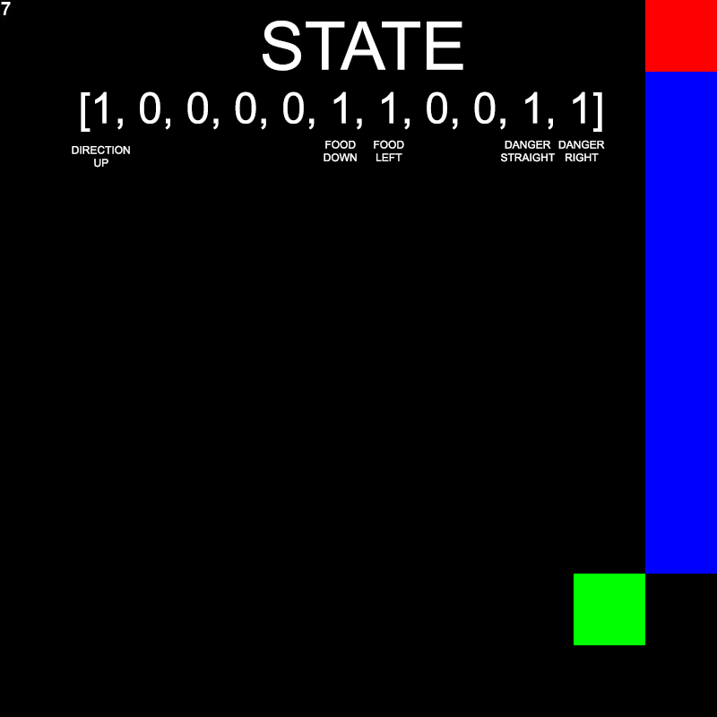
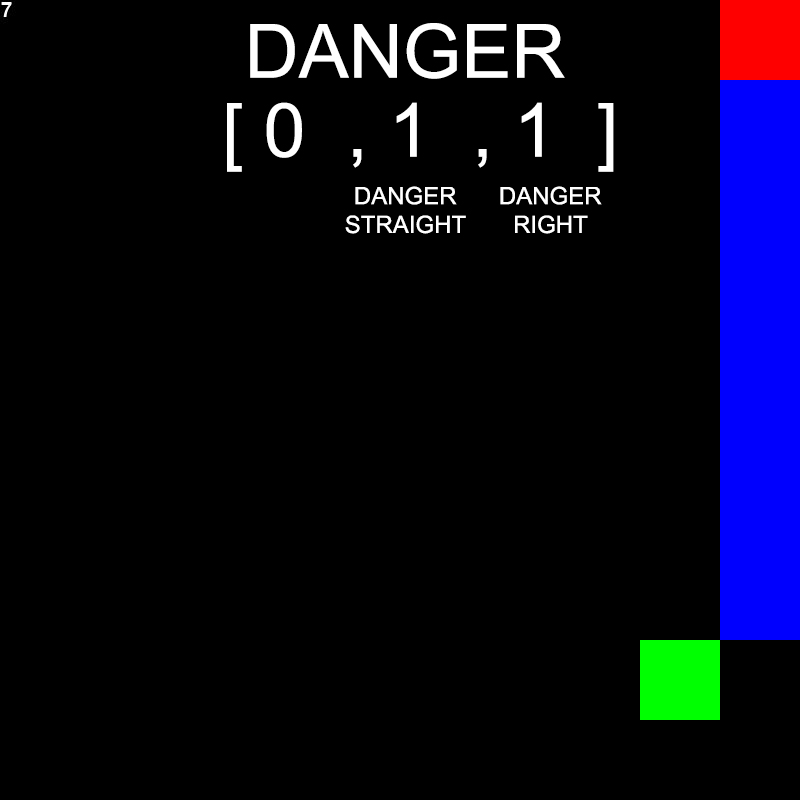
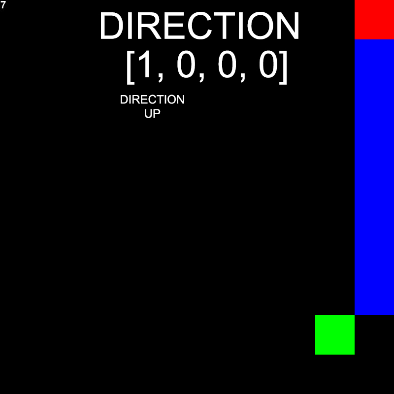
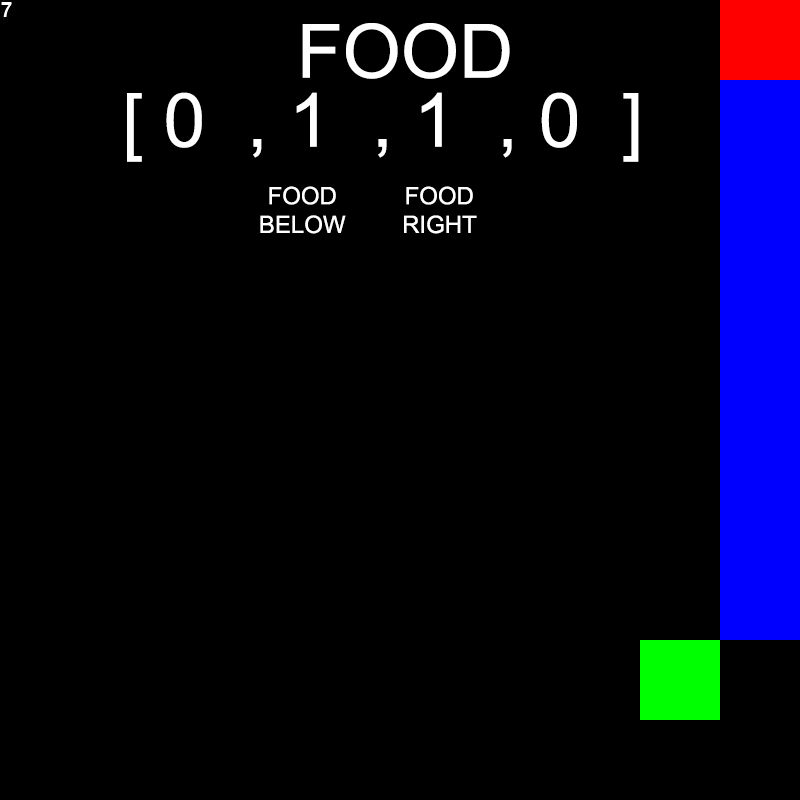

# 1. Boolean State Representation
The state representation chosen is a boolean vector which includes the following information
* whether there is any immediate danger around the snake's head
* the current absolute direction of the snake
* the location of the food relative to the snake's head

Using a boolean state representation means that the set of possible states the snake has to 
learn is smaller than a state that is represented with scalars for instance. In fact, the 
set of states will remain the same size, no matter the size of the game. It means that we can
train the snake on a smaller game and run it on any size game.

There is of course more information that can be useful, e.g. the current length of the snake or
the position of all of the snake's segments. The reason they are not considered here is because
of the simplicity of using a boolean vector. It encodes less information and likely won't help
the snake completely finish the game, yet still lets the snake do some learning to show the
effectiveness of using evolutionary algorithms.

Since we need the inputs to our neural network to be numbers, the boolean values `true` and
`false` are represented by `1` and `0` respectively.



# 2. Immediate Danger
The immediate danger is a 1D vector of 3 booleans which tells the snake whether there is any 
danger to the left, right, or straight ahead of the snake's head. The first value indicates 
danger to the left, the second value is for danger straight ahead, and the third value is for 
danger right. Danger means that a move in that direction will cause the game to be over.
Here are some example vectors:

```
[1, 0, 0] -> danger to the left
[0, 1, 0] -> danger straight ahead
[0, 0, 1] -> danger to the right
[1, 1, 0] -> danger to the left and straight ahead
[1, 1, 1] -> danger to the left, straight ahead, and to the right
```



# 3. Absolute Direction
The absolute direction is a 1D vector of 4 booleans which tells the snake whether it is currently
moving left, right, up, or down in the game. Because the snake can only move in one direction
at a given point in time, the vector must only have one value set to `1`. This gives the following
possibilities:

```
[1, 0, 0, 0] -> direction is up
[0, 1, 0, 0] -> direction is down
[0, 0, 1, 0] -> direction is left
[0, 0, 0, 1] -> direction is right
```



# 4. Food Location
The location of the food is a 1D vector of 4 booleans which tells the snake the direction of the 
food relative to snake's head. As we want the snake to move towards the food, the absolute direction
defined in the previous section will help the snake pick the correct action for the next move.
Example values for the vector are:

``` 
[1, 0, 0, 0] -> the food is above the snake's head in the same column
[0, 1, 0, 0] -> the food is below the snake's head in the same column
[0, 0, 1, 0] -> the food is to the left of the snake's head in the same row
[0, 0, 0, 1] -> the food is to the right of the snake's head in the same row
[1, 0, 1, 0] -> the food is up to the left of the snake's head
[0, 1, 0, 1] -> the food is down to the right of the snake's head
```



