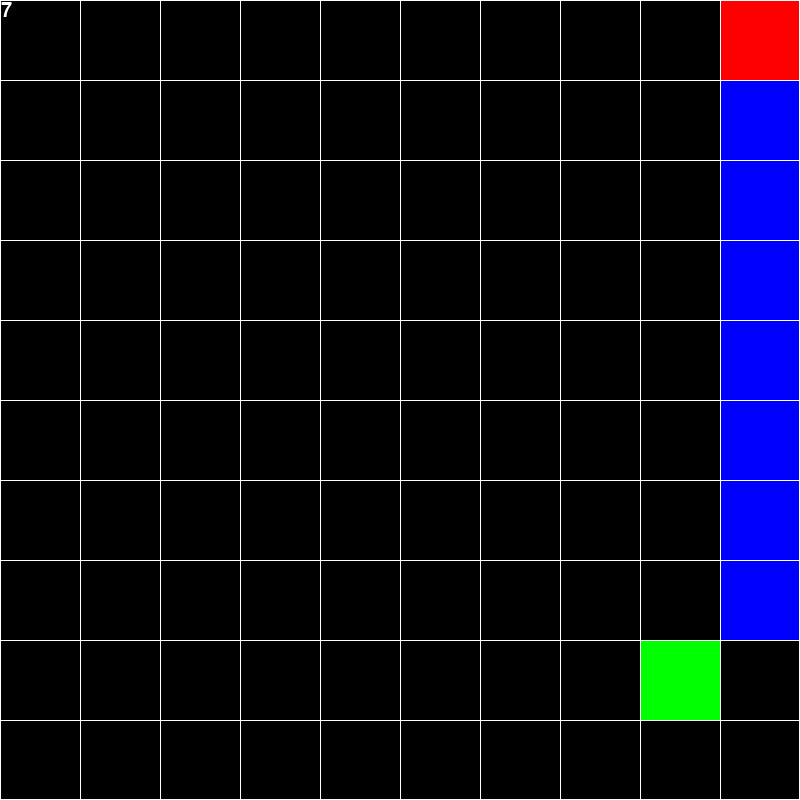

# 1. Grid State Representation
This state representation is analogous to how a player perceives a frame of the game.
It is a top view of the game environment, encompassing all spatial data that represents
the game. The state is a 2D matrix where the snake and food positions are entries within that matrix.

# 2. Grid Size
The state is a square matrix (n x n). The size of the matrix depends on the size of the game as well
as the size of the snake where n is determined as follows:

```
n = (width * height) / snake_size
```

* `width` **(int)**: the width of the game in pixels
* `height` **(int)**: the height of the game in pixels
* `snake_size` **(int)**: the size of the snake in the game in pixels

# 3. Example
The grid shown here is from a game where `n = 10`. The frame is translated into the matrix on the right. The meaning of the values in the matrix are as follows:
* `0`: empty space
* `255`: head of the snake
* `191`: body of the snake
* `127`: food

The difference in values between the snake's head and the snake's body is so that the next movement of the snake
can be planned better.



```
[[0, 0, 0, 0, 0, 0, 0, 0, 0, 255],
[0, 0, 0, 0, 0, 0, 0, 0, 0, 191],
[0, 0, 0, 0, 0, 0, 0, 0, 0, 191],
[0, 0, 0, 0, 0, 0, 0, 0, 0, 191],
[0, 0, 0, 0, 0, 0, 0, 0, 0, 191],
[0, 0, 0, 0, 0, 0, 0, 0, 0, 191],
[0, 0, 0, 0, 0, 0, 0, 0, 0, 191],
[0, 0, 0, 0, 0, 0, 0, 0, 0, 191],
[0, 0, 0, 0, 0, 0, 0, 0, 127, 0],
[0, 0, 0, 0, 0, 0, 0, 0, 0, 0]]
```


